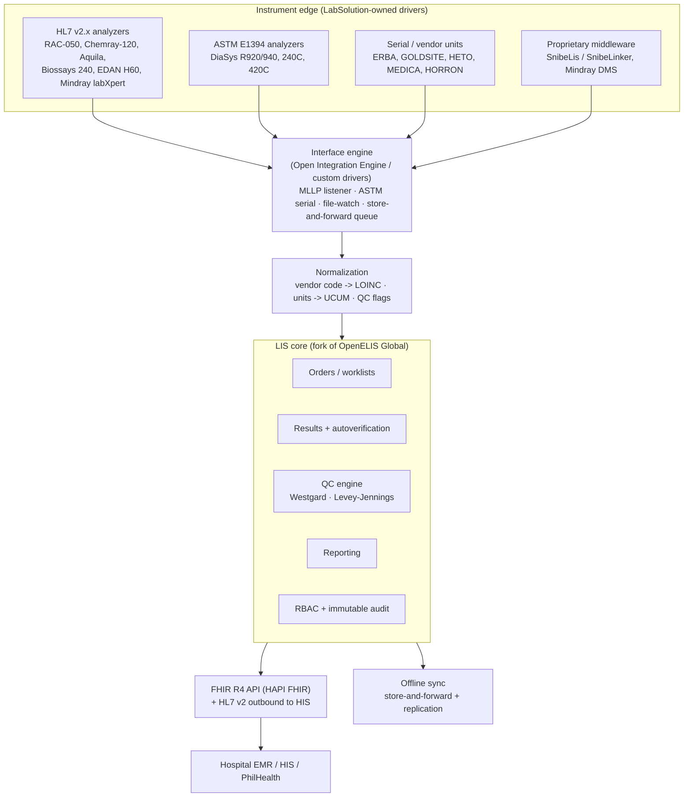

# Building a Custom LIS and Instrument Integration for LabSolution Technology

> Internal research / architecture report. Audience: LabSolution engineering +
> operations leadership. Status: **research draft for decision** (2026-06-20).
>
> **Methodology & provenance.** The fleet protocol matrix (§3) is extracted from
> LabSolution's own analyzer interface manuals in this repo (cited as clickable
> links). The standards, OSS, regulatory, and architecture sections are grounded
> in external sources (cited inline) and cross-checked against the corpus. This
> pass was authored in the main session after the planned multi-agent workflow
> was blocked by a session token limit; it should be treated as a strong v1 to be
> peer-reviewed, not a final committed design.
>
> **Verification pass (2026-06-21).** The external claims below (OSS projects and
> licenses, interoperability standards, and Philippine regulations) were
> independently fact-checked against current primary sources. Corrections and
> freshness notes from that pass are folded in inline; see the **Verification
> change-log** at the end for the itemized list.

---

## 1. Executive summary — the verdict

**Do not build the whole LIS from scratch. Build the part that is genuinely yours
— the instrument-integration layer and the LabSolution-specific workflow — and
stand it on proven open-source cores.** Concretely, the recommended target is a
**hybrid**:

- **Instrument edge:** a LabSolution-owned **driver/interface layer** built on an
  open-source HL7/ASTM toolchain (HAPI HL7 v2 or python-hl7 + an MLLP/serial
  transport, optionally orchestrated by the **Open Integration Engine** — the
  open fork of Mirth Connect 4.5.2). This is where your differentiation and your
  real cost live, because *your fleet's protocol mix is the asset no off-the-shelf
  LIS already covers.*
- **LIS core:** **fork OpenELIS Global** (clinical, ASTM LIS2-A2 + HL7 native,
  field-proven in low-resource settings, plugin architecture) rather than writing
  orders/results/QC/reporting/RBAC/audit from zero. Reserve a true greenfield core
  only if a hard requirement (e.g. a billing/ERP coupling) makes the fork
  uneconomic — §6 scores this.
- **API surface:** expose **FHIR R4** (HAPI FHIR) for EMR/HIS integration and
  future-proofing, while keeping **HL7 v2 / ASTM at the instrument edge**.

Why: greenfish-from-zero spends 80% of the budget rebuilding solved problems
(message parsing, QC math, audit, RBAC, reporting) and inherits the full ISO
15189 / RA 10173 validation burden alone. The corpus shows your instruments speak
**two mainstream standards (HL7 v2.x + ASTM E1394/LIS2-A2) plus two proprietary
tails (SnibeLis, Mindray labXpert/DMS)** — exactly what OpenELIS's analyzer model
is designed to absorb, and exactly the integration work that no vendor will do
for you.

**The single biggest risk is not technical — it is regulatory.** A LIS is a
different risk class than this knowledge repo: **it stores PHI** (patient
identifiers + results), so RA 10173 (Data Privacy Act) and ISO 15189 record/audit
controls are binding from day one. §2 and §10.

---

## 2. A LIS is a different risk class than this repo

This knowledge repo is explicitly **"No PHI, no patient identifiers, no lab
results"** (CLAUDE.md §2). A LIS is the opposite: its entire job is to hold
patient demographics, orders, and results. That single fact changes the
engineering contract:

| Concern | This repo | A LIS |
|---|---|---|
| Data class | Public/vendor docs | **PHI** (RA 10173 sensitive personal info) |
| Privacy regime | n/a | RA 10173 + NPC registration, breach notification |
| Accreditation | n/a | ISO 15189:2022; DOH AO 2021-0037 licensing |
| Audit trail | Git history | Immutable, per-record who/what/when/before/after |
| Access control | File perms | Enforced RBAC, named users, session control |
| Validation | None | IQ/OQ/PQ; documented system validation |
| Retention | Indefinite | Defined retention + secure disposal |

**Design consequence:** RBAC, an append-only audit log, encryption at rest/in
transit, and a validation dossier are **architectural requirements, not
features**. They must be in the core from the first sprint, which is itself a
strong argument for forking a system that already has them (§6).

---

## 3. The fleet reality — what your instruments actually speak

Extracted from the LIS/HL7/ASTM interface docs in this repo. Group decides the
integration strategy. Citations are clickable; `p.` anchors open the PDF at that
page.

### 3.1 HL7 v2.x group (network / MLLP — highest-value, do first)

| Vendor | Model(s) | Protocol | Transport | Direction | Evidence |
|---|---|---|---|---|---|
| RAYTO | RAC-050 (coagulation) | HL7 **v2.3** | MLLP over TCP/IP | **Bidirectional** (ORU^R01 results up; host query for orders; ACK^R01) | [RAYTO RAC-050 HL7 Host Interface Manual p.1](file:///home/marloeu/projects/manuals-and-lis-protocol/manuals-and-lis-protocol/RAYTO/RAC-050/RAC-050-HL7-Host-Interface-Manual-V1.0e.pdf#page=1) |
| RAYTO | Chemray-120 (chemistry) | HL7 | TCP | result/query | [RAYTO Chemray-120 Communication Protocol (HL7) p.1](file:///home/marloeu/projects/manuals-and-lis-protocol/manuals-and-lis-protocol/RAYTO/Chemray-120/Chemray-120-Communication-protocol-%28HL7%29.pdf#page=1) |
| DIATRON | Aquila | HL7 | TCP | result/query | [DIATRON Aquila HL7 Communication Protocol r01 p.1](file:///home/marloeu/projects/manuals-and-lis-protocol/manuals-and-lis-protocol/DIATRON/Aquila/Diatron_Aquila_HL7_Communication-Protocol-r01.pdf#page=1) |
| SNIBE | Biossays 240 Plus/Pro | HL7 | TCP | result/query | [SNIBE Biossays 240 Plus Interface Specifications (HL7) p.1](file:///home/marloeu/projects/manuals-and-lis-protocol/manuals-and-lis-protocol/SNIBE/BIOSSAYS-240-Pro/Interface-Specifications-of-Biossays-240-Plus-Software-System-EN-20200320HL7.pdf#page=1) |
| EDAN | H60S (+H60 Vet) | HL7 | TCP/serial | result/query | [EDAN H60 LIS Communication Protocol p.1](file:///home/marloeu/projects/manuals-and-lis-protocol/manuals-and-lis-protocol/EDAN/H60S/LIS/LIS-Communication-Protocol-h60.pdf#page=1) |
| MINDRAY | labXpert urine line: **EU-5300 Pro, EU-5600 Pro, EU-8600, EH-2090, UA-5600** | HL7 v2.x | **TCP (server *or* client) + MLLP; also Windows shared-folder file mode** | **Duplex/bidirectional**; segments MSH/MSA/PID/PV1/OBR/OBX/ORC; Base64 payloads | [MINDRAY labXpert Communication Protocol v4.0 p.5](file:///home/marloeu/projects/manuals-and-lis-protocol/manuals-and-lis-protocol/MINDRAY/EU-5600-Pro/EU-5300Pro-EU-5600Pro-EU8600-EH2090-UA5600-Urine-LabXpert-Lis-Protocol_V4.0_EN.pdf#page=5) |

The RAC-050 graph node confirms the HL7 building blocks present across this group:
**MSH, PID, OBR, OBX, ORU^R01, ACK^R01, MSA, MLLP framing (`<SB>0x0B … <EB>0x1C
<CR>0x0D`), HL7 v2.3, TCP/IP transport** — i.e. a standard HL7 v2 stack.

### 3.2 ASTM E1394 / CLSI LIS2-A2 group (serial + TCP)

| Vendor | Model(s) | Protocol | Transport | Direction | Evidence |
|---|---|---|---|---|---|
| DIASYS | Respons **920 / 940** | **ASTM E1394** (Host Interface Doc v2.0, Mar 2010) | RS232 (physical layer specified) | **Bidirectional** (Request-Information / query record) | [DiaSys R920 ASTM-HOST Manual — records p.26–35](file:///home/marloeu/projects/manuals-and-lis-protocol/manuals-and-lis-protocol/DIASYS/RESPONS-940/R920-ASTM-HOST-DiaSys-Manual.pdf#page=26) · [checksum p.23](file:///home/marloeu/projects/manuals-and-lis-protocol/manuals-and-lis-protocol/DIASYS/RESPONS-940/R920-ASTM-HOST-DiaSys-Manual.pdf#page=23) |
| DIASYS | Respons 240C | Vendor LIS (ASTM-style) | serial | upload/query | [DIASYS RESPONS-240C LIS Manual p.1](file:///home/marloeu/projects/manuals-and-lis-protocol/manuals-and-lis-protocol/DIASYS/RESPONS-240C/LIS-manual.pdf#page=1) |
| DIASYS | Respons 420C | Vendor LIS (ASTM-style) | serial | upload/query | [DIASYS RESPONS-420C LIS-420c p.1](file:///home/marloeu/projects/manuals-and-lis-protocol/manuals-and-lis-protocol/DIASYS/RESPONS-420C/LIS-420c.pdf#page=1) |

The DiaSys ASTM-HOST doc is your **reference implementation** of ASTM E1394: it
documents the OSI layering, RS232 physical layer, lower-level ENQ/ACK framing,
**checksum calculation**, the special-function-character table, and the full
record set — **H** (Message Header), **P** (Patient), **O** (Test Order), **R**
(Result), **C** (Comment), **Q** (Request Information/query), **L** (Message
Terminator). Build your ASTM parser to this doc and most serial analyzers fall in
line.

### 3.3 Small serial / electrolyte / blood-gas / chemistry units (vendor-specific, often upload-only)

| Vendor | Model(s) | Protocol | Transport | Evidence |
|---|---|---|---|---|
| ERBA | EC90 (electrolyte) | LIS comm (ASTM-ish) | serial | [ERBA EC90 LIS Communication p.1](file:///home/marloeu/projects/manuals-and-lis-protocol/manuals-and-lis-protocol/ERBA/EC90/EC90-LIS-communication.pdf#page=1) |
| GOLDSITE | GPP-100 | LIS interface | serial/TCP | [GOLDSITE GPP-100 LIS Interface Manual p.1](file:///home/marloeu/projects/manuals-and-lis-protocol/manuals-and-lis-protocol/GOLDSITE/GPP-100/Instruction-Manual-of-LIS-Interface-EN-V1-20191012.pdf#page=1) |
| HETO | Konig AP300 (chemistry) | LIS Protocol v2.1 | serial | [HETO Konig LIS Protocol v2.1 p.1](file:///home/marloeu/projects/manuals-and-lis-protocol/manuals-and-lis-protocol/HETO/Konig-AP300/Konig-LIS-Protocol-EN-V2.1.pdf#page=1) |
| MEDICA | Easy-series (EBG/EEL/EL/ES) | LIS in operator manual | serial | [MEDICA ES Operator's Manual p.1](file:///home/marloeu/projects/manuals-and-lis-protocol/manuals-and-lis-protocol/MEDICA/ES-Files/ES-Operators-Manual-English-Ca-Cl-006576-901R0.pdf#page=1) |
| HORRON | EA2000 electrolyte | RS232 serial (DB9 / USB-serial, "Horron-lis" PC app) | serial | [HORRON LIS System for Electrolyte Analyzer p.1](file:///home/marloeu/projects/manuals-and-lis-protocol/manuals-and-lis-protocol/HORRON/Lis-System-for-Electrolyte-Analyzer.pdf#page=1) |
| AIKANG | (vendor-level) | LIS-connect | — | [AIKANG LIS-connect p.1](file:///home/marloeu/projects/manuals-and-lis-protocol/manuals-and-lis-protocol/AIKANG/LIS-connect.pdf#page=1) |

> ⚠️ **Extracted by Claude vision from a pure-image source PDF (engineer review
> required) —** the HORRON serial/DB9/USB-serial detail comes from a
> vision-extracted sidecar flagged `requires_engineer_review: True`. Treat it as a
> lead, not ground truth; verify against the source PDF before building the driver.

### 3.4 Proprietary middleware tails (do last — highest effort)

| Vendor | Scope | Reality | Evidence |
|---|---|---|---|
| SNIBE | MAGLUMI X3 / X6 / 800 (CLIA immunoassay) | Snibe ships its **own LIS middleware — "SnibeLis" / "SnibeLinker"** (registered trademarks; applicable SW 1.18.8.27+). MAGLUMI ↔ LIS goes **through Snibe's layer**, not raw HL7. You integrate to SnibeLis (or reverse its output), you don't get a clean vanilla HL7 socket. **⮕ Superseded 2026-07-06 (LIS-178):** the X3's own IFU (v1.4, App. B) documents a **native built-in LIS interface** — ASTM E1394-97 (or HL7 v2.5, SNIBE dialect) over TCP direct to *any* host; SnibeLis is optional middleware, not a required broker. The LIS attaches the X3 natively (ADR-0008/0015 amendments). | [SNIBE SnibeLis User Manual v1.1 p.1](file:///home/marloeu/projects/manuals-and-lis-protocol/manuals-and-lis-protocol/SNIBE/MAGLUMI-X3/SnibeLisLIS-User-ManualV1.1_EN-version_20191015.pdf#page=1) · [MAGLUMI X3 IFU v1.4 App. B p.131](file:///home/marloeu/projects/manuals-and-lis-protocol/manuals-and-lis-protocol/SNIBE/MAGLUMI-X3/437-2-MAGLUMI-X3-IFU-en-V1.4.pdf#page=131) |
| MINDRAY | BC hematology series, etc. | Mindray's **labXpert / DMS** middleware. The urine line (§3.1) is clean HL7 v2.x; hematology integration is typically via Mindray DMS export. | [MINDRAY BC-760/780 Operator's Manual — Communication section](file:///home/marloeu/projects/manuals-and-lis-protocol/manuals-and-lis-protocol/MINDRAY/BC-760-780/BC-760%26780_Operator_s-Manual_EN_V7.0.textified.md) |

### 3.5 Coverage gap — flag, don't assume

Several units (many MINDRAY BC hematology models, WONDFO ACCRE, etc.) mention LIS
capability in service manuals but have **no dedicated protocol document on file**.
Status: *supported, protocol doc not on file — verify per unit before committing a
channel.* Direction (uni- vs bi-directional) and exact framing must be confirmed
on the bench for every unit in §3.3 and §3.5.

**Net:** ~6 models in clean HL7 v2.x, ~3 DiaSys in canonical ASTM, ~6 small units
in vendor-serial (mostly ASTM-ish/upload), 2 proprietary middleware families. That
distribution is the spine of the whole plan.

---

## 4. Standards you must implement

### 4.1 HL7 v2.x (the instrument lingua franca)
- **Messages:** orders `ORM^O01` / `OML^O21` (LIS→analyzer or host-query reply) —
  `OML^O21` is the modern lab-automation order and `ORM^O01` is retained for
  backward compatibility, so they are not interchangeable peers — results
  `ORU^R01` (analyzer→LIS); `ACK` acknowledgements. QC results also ride
  `ORU^R01` (Snibe/Rayto flag QC in MSH-bound application ack types).
- **Segments a LIS must parse *and* emit:** `MSH` (header/encoding chars),
  `PID` (patient), `PV1` (visit), `ORC` (common order), `OBR` (observation
  request / panel), `OBX` (observation/result — one per analyte), `NTE` (notes),
  `MSA`/`ERR` (ack/error), `SPM` (specimen, v2.5+).
- **Transport:** **MLLP** frame = `0x0B <message> 0x1C 0x0D` over a persistent
  TCP socket. Support **original *and* enhanced acknowledgement** modes.
- **Version reality:** your fleet is mostly **v2.3** (RAC-050 explicitly). Parse
  tolerantly (low-cost analyzers under-populate optional fields and sometimes
  mis-order components); target v2.3 with forward-compat to v2.5.1.
- **Library:** [HAPI HL7 v2 (Java — dual-licensed **MPL/GPL**, copyleft)](https://hapifhir.github.io/hapi-hl7v2/) or
  [hl7apy (Python, MIT)](https://github.com/crs4/hl7apy) / python-hl7 (BSD) — do
  **not** hand-roll the parser.

### 4.2 ASTM E1381 / CLSI LIS01-A2 (transport) + ASTM E1394 / CLSI LIS02-A2 (content)
- **Low level (ASTM E1381 / LIS01-A2):** `ENQ/ACK/NAK/EOT` line contention; frames
  `<STX> FN text <ETB|ETX> C1 C2 <CR><LF>` with **modulo-256 checksum**; RS232
  settings per device. The DiaSys ASTM-HOST doc (§3.2) is your spec.
- **High level (ASTM E1394 / LIS02-A2):** record hierarchy **H → P → O → R → C/M → L**, with
  field `|`, repeat `\`, component `^`, escape `&` delimiters; bidirectional uses
  the **Q (query)** record.
- **Repo has the standard itself:** [CLSI LIS2-A2 p.1](file:///home/marloeu/projects/manuals-and-lis-protocol/manuals-and-lis-protocol/CLSI_LIS2-A2.pdf#page=1)
  — read it before writing the parser.
- **Library:** thin; most teams implement ASTM directly (it's small) or use an
  interface engine's ASTM connector. `python-astm` exists but is effectively
  unmaintained (last release 2013) — prefer the OpenELIS analyzer-bridge's ASTM
  connector or an interface-engine connector.

### 4.3 Result/test coding — LOINC + UCUM (non-negotiable for interoperability)
- **LOINC** for every test/analyte identifier; maintain a **vendor-code → LOINC**
  mapping table (this is ongoing curation work — your repo's alias-table pattern
  is the right model to reuse). [loinc.org](https://loinc.org)
- **UCUM** for unit-of-measure normalization (mg/dL vs mmol/L). [ucum.org](https://ucum.org)
- **SNOMED CT** for specimen types and qualitative results (pos/neg/reactive).
- Store both the raw analyzer code/unit *and* the normalized LOINC/UCUM, so you can
  re-map without re-ingesting. This is a first-class column in the result table.

### 4.4 FHIR R4 (the modern API layer — recommended, not at the edge)
- **Division of labor:** HL7 v2 / ASTM at the **instrument edge**; **FHIR R4** as
  the **EMR/HIS/app API**. Don't try to make analyzers speak FHIR.
- **Lab resources:** `ServiceRequest` (order), `Specimen`, `DiagnosticReport`,
  `Observation` (result), `Patient`, `Device` (the analyzer).
- **Server:** [HAPI FHIR (Apache 2.0)](https://hapifhir.io/) or
  [Medplum (Apache 2.0)](https://www.medplum.com/) — both production OSS.
- Payoff: future EMR integrations and DOH/PhilHealth interoperability become a
  config exercise instead of a bespoke build.

Sources: [HAPI HL7v2](https://hapifhir.github.io/hapi-hl7v2/) · [HL7 FHIR open-source implementations](https://confluence.hl7.org/display/FHIR/Open+Source+Implementations).

---

## 5. Reference architecture

### 5.1 Domain / data model (entities + key relations)
- **Patient** (1) ─ has many ─ **Order/Requisition**
- **Order** ─ has many ─ **Specimen/Sample** ─ generates ─ **Result**
- **Test/Analyte** (catalog; carries LOINC + default UCUM unit + reference ranges)
- **Result** → belongs to Order+Specimen+Analyte; stores `raw_value`, `raw_unit`,
  `raw_code`, `loinc`, `ucum_value`, `status` (preliminary/final/corrected),
  `verified_by`, `instrument_id`, `flags`
- **Instrument** ─ connects via ─ **InterfaceChannel** (protocol, transport,
  direction, config)
- **QCResult** → Analyte + Instrument + QC lot; feeds **Westgard/Levey-Jennings**
- **Worklist** (pending orders pulled by analyzers in host-query mode)
- **Report** (per order/patient; PDF + structured)
- **User** ─ has ─ **Role** (RBAC); every mutation writes an **AuditEvent**
  (who/what/when/before/after, append-only)

### 5.2 Layering principles
1. **Interface engine is separate from the LIS core.** Each analyzer gets a
   channel; a bad driver can't corrupt the core. This also lets you ship a unit's
   integration without redeploying the LIS.
2. **Normalize at ingest** (LOINC/UCUM/QC flags) so the core is vendor-agnostic.
3. **Autoverification + QC rules are a rules engine,** not hardcoded — Westgard
   multirules, delta checks, reference-range gating.
4. **Audit + RBAC are cross-cutting,** enforced in the core, not per-feature.

---

## 6. Build vs fork vs buy — scored decision

Scoring 1 (worst) – 5 (best) for this scenario (~28 analyzer families, two
standards + two proprietary tails, hospital + low-connectivity customers).

| Criterion (weight) | (1) Greenfield | (2) Fork OpenELIS | (3) Thin core + OSS engine | (4) SENAITE base | (5) Commercial LIS |
|---|---|---|---|---|---|
| Time-to-first-result (×3) | 1 | 4 | 3 | 3 | 5 |
| Eng. effort / headcount (×3) | 1 | 4 | 3 | 3 | 5 |
| Instrument coverage for free (×3) | 1 | 5 | 3 | 2 | 4 |
| Maintenance / TCO (×2) | 2 | 4 | 3 | 3 | 2 |
| Regulatory/validation burden (×3) | 1 | 4 | 3 | 3 | 4 |
| Customization ceiling (×2) | 5 | 4 | 5 | 4 | 1 |
| IP ownership / no lock-in (×2) | 5 | 4 | 5 | 4 | 1 |
| **Weighted total (/90)** | **~33** | **~75** | **~62** | **~58** | **~62** |

**Recommendation: (2) Fork OpenELIS Global as the LIS core + a LabSolution-owned
instrument-driver layer (the best of strategy 3) on top.** It wins on the criteria
that dominate a distributor's economics — instrument coverage gained for free,
time-to-result, and a pre-built ISO-15189/audit/RBAC core — while keeping full
customization and IP because OpenELIS is open-source (you own your plugins and
fork). Greenfield scores worst: it maximizes control you don't need at the cost of
rebuilding solved infrastructure and shouldering the entire validation burden.

**When to revisit:** if a hard ERP/billing coupling or a non-clinical workflow
makes the OpenELIS data model fight you, escalate strategy (3) — keep the OSS
interface engine, write a thin bespoke core. Commercial LIS is only rational if
time-to-market dwarfs every other concern *and* you accept lock-in (disqualifying
for a company whose product *is* integration).

---

## 7. Reusable OSS components

| Component | Role | Language | License | Embed? |
|---|---|---|---|---|
| **OpenELIS Global** | Clinical LIS core (orders/results/QC/report/RBAC/audit), native ASTM E1381/E1394 + HL7 v2.5.1 | Java (Spring Boot) + React | **MPL-2.0** | **Fork as core** |
| **OpenELIS analyzer-bridge** | Middleware: ASTM, HL7/MLLP, RS232 serial, file → HTTP to OpenELIS | Java | ⚠️ **license TBD (undeclared)** | **Yes — serial + file units; confirm license before embedding** ([repo](https://github.com/DIGI-UW/openelis-analyzer-bridge)) |
| **openelisglobal-plugins** | Per-analyzer plugin pattern (35+ analyzers upstream) | Java | **MPL-2.0** | **Yes — your driver home** ([repo](https://github.com/DIGI-UW/openelisglobal-plugins)) |
| **HAPI HL7 v2** | HL7 v2.x parse/build | Java | **MPL/GPL** (dual, copyleft) | Yes (if Java core) ([site](https://hapifhir.github.io/hapi-hl7v2/)) |
| **hl7apy** | HL7 v2.x parse/build | Python | MIT | Yes (if Python tooling) ([repo](https://github.com/crs4/hl7apy)) |
| **python-hl7** | Lightweight HL7 v2 + MLLP | Python | BSD | MLLP **client** only — use `twisted-hl7` or the engine for the listener; last release 2022 |
| **Open Integration Engine** / **BridgeLink** | HL7/ASTM channel engine (forks of Mirth 4.5.2 — Mirth went commercial at 4.6, Mar 2025; OIE now at 4.6.0-rc1 + applying to the Eclipse Foundation, May–Jun 2026) | Java | **MPL-2.0** | Optional — for many heterogeneous channels ([OIE](https://openintegrationengine.org)) |
| **HAPI FHIR** | FHIR R4 server / API | Java | Apache 2.0 | Yes — EMR API ([site](https://hapifhir.io/)) |
| **Medplum** | FHIR-native backend (auth, access policies) | TS | Apache 2.0 | Alternative API layer ([site](https://www.medplum.com/)) |
| **SENAITE / senaite.astm** | Alt LIMS + ASTM middleware | Python/Plone | **GPLv2** | Reference only |
| LOINC tables / RELMA | Test coding | — | LOINC license (free) | Yes ([loinc.org](https://loinc.org)) |

> ⚠️ **Do not build on Mirth Connect itself** — NextGen made it commercial-only at
> v4.6 (19 Mar 2025); 4.5.2 is the last open-source release. Use the
> Open Integration Engine / BridgeLink forks (both MPL-2.0). As of mid-2026, OIE
> has shipped a **4.6.0 release candidate** and applied to join the **Eclipse
> Foundation** (vendor-neutral governance) — both strengthen this choice over a
> single-vendor fork.

---

## 8. Per-vendor integration plan (sequenced)

**Phase order = falling protocol-cleanliness, rising effort:**

1. **HL7 v2.x group first** (RAC-050, Chemray-120, Aquila, Biossays 240, EDAN H60,
   Mindray labXpert). One MLLP listener + HL7 v2.3 parser covers all six; labXpert
   gives you a fully-documented bidirectional reference incl. file-mode fallback.
   *These are your fastest "first result through the pipe."*
2. **ASTM/serial group** (DiaSys 920/940/240C/420C, then ERBA, GOLDSITE, HETO,
   MEDICA, HORRON). Build the ASTM E1394 stack to the DiaSys ASTM-HOST spec; route
   the small serial units through the analyzer-bridge's RS232 connector. Confirm
   direction per unit (most are upload-only). **Re-verify the HORRON detail against
   its source PDF (vision-extracted).**
3. **Proprietary tails last** (SnibeLis/SnibeLinker for MAGLUMI; Mindray DMS for BC
   hematology). These don't expose vanilla HL7 — you either (a) configure SnibeLis
   to emit HL7/ASTM to your engine, or (b) ingest its export/DB. Highest
   reverse-mapping effort; the repo's SnibeLis manual + Mindray protocol docs are
   the spec inputs. *(⮕ Superseded for the MAGLUMI X3, 2026-07-06 / LIS-178: the X3
   attaches natively — built-in ASTM E1394-97 LIS interface direct to the bridge, no
   SnibeLis; see §3.4 note and the implementation plan §Stage 3.)*
4. **Contribute generic mappings upstream** to `openelisglobal-plugins` so you ride
   community maintenance for standards-compliant units and keep only the
   LabSolution-specific tails private.

---

## 9. Offline-first / low-connectivity design (Mindanao-class sites)

- **Store-and-forward at the edge:** the interface engine queues results locally
  (durable queue / embedded DB) and forwards when the link returns — results are
  never lost during an outage. This is the single most important resilience
  feature for rural sites.
- **Local-first deployment:** run the LIS core **on-prem at each site** (or
  per-region), syncing to a central instance, rather than a cloud-only LIS that
  dies when the WAN does. OpenELIS is routinely deployed this way in low-resource
  national lab networks.
- **Sync + conflict resolution:** PostgreSQL logical replication or a CRDT/sync
  layer (CouchDB/PouchDB, ElectricSQL) for site↔central; last-writer-wins is
  unsafe for results — use append-only result versions + explicit reconciliation.
- **Audit during outages:** the audit log must be local-durable and merge without
  gaps; never let a network outage create an unlogged mutation.

---

## 10. Regulatory & compliance plan

| Regime | What it is | What it forces into the LIS |
|---|---|---|
| **RA 4688** (Clinical Laboratory Law) | Governs establishment/operation of PH clinical labs; DOH registration & physician direction | The LIS must support licensed-lab workflows + pathologist/physician result release |
| **DOH AO 2021-0037** (supersedes AO 2007-0027) | Current rules on regulation/licensing of clinical labs by RA 4688 | Lab classification-aware config; record control; result authority |
| **RA 5527** (Medical Technology Act) | Medtech personnel scope | Named-user RBAC mapped to medtech/pathologist roles |
| **RA 10173** (Data Privacy Act, **2012**) + NPC | PHI is sensitive personal info | NPC compliance, lawful basis, **encryption**, access logging, **breach notification**, data-subject rights, retention/disposal |
| **ISO 15189:2022** | Med-lab quality & competence | LIS **validation** (IQ/OQ/PQ), record control, equipment/result **traceability**, immutable **audit trail**, change control |
| **PNPAQC / EQAS** | External quality assessment | QC + proficiency-testing result handling |

**Design obligations (all binding from sprint 1):** named-user RBAC; append-only
audit (who/what/when/before/after); encryption in transit (TLS on MLLP/sync) and
at rest; defined retention + secure disposal; a written **validation dossier**
(the OpenELIS fork helps — you validate a known base + your deltas, not a black
box); NPC registration before go-live — now governed by **NPC Circular 2022-04**
(via the online NPCRS), mandatory when processing sensitive personal info of
**≥1,000 individuals**, with **≥250 employees**, or doing high-risk processing
(any real LIS clears this). Sources:
[DOH AO 2021-0037 (PCQACL PDF)](https://pcqacl.org/home/attachment/DOH-AO-37-S.-2021.pdf) ·
[BRAP summary of new clinical-lab rules](https://bioriskassociationphilippines.org/2021/06/16/new-rules-and-regulations-governing-the-regulation-of-clinical-laboratories-in-the-philippines/) ·
[AO 59 s.2001 (historical baseline)](https://elibrary.judiciary.gov.ph/thebookshelf/showdocs/10/38647).

> ⚠️ **Regulatory currency (2026):** DOH AO 2021-0037 is still the governing AO
> but has a **draft amendment in HFSRB public consultation** (not yet signed —
> track it). **ISO 15189:2022** is the live edition (the 2012 transition closed
> end-2025, so :2012 is retired). NPC registration runs through **NPC Circular
> 2022-04 / NPCRS** (Circular 17-01 is obsolete). Re-confirm all three before go-live.

---

## 11. Phased roadmap

| Phase | Goal | Key deliverables | Rough effort |
|---|---|---|---|
| **0 — Foundations** | Stand up the core, settle compliance | OpenELIS fork running; data model reviewed; LOINC/UCUM tables seeded; RBAC + audit verified; NPC/ISO plan drafted | 4–6 wks, 2 eng + 1 QA/regulatory |
| **1 — HL7 v2 edge** | First real results flowing | MLLP listener + HL7 v2.3 parser; RAC-050 + Mindray labXpert end-to-end; normalization to LOINC/UCUM; **"first result through the pipe" milestone** | 4–6 wks, 2 eng |
| **2 — ASTM/serial edge** | Cover chemistry/electrolyte fleet | ASTM E1394 stack to DiaSys spec; analyzer-bridge serial channels; DiaSys + ERBA + GOLDSITE + HETO + MEDICA live; HORRON verified | 6–8 wks, 2 eng |
| **3 — Proprietary tails** | MAGLUMI + Mindray hematology | SnibeLis/SnibeLinker integration; Mindray DMS ingest | 4–6 wks, 2 eng |
| **4 — API + offline** | EMR-ready + rural-ready | FHIR R4 (HAPI FHIR); store-and-forward + site↔central sync; on-prem deploy kit | 4–6 wks, 2 eng |
| **5 — Validation + pilot** | Production at one site | IQ/OQ/PQ dossier; pilot lab go-live; QC/Westgard tuned | 4–6 wks, cross-functional |

Indicative total: **~6–9 months** with a small team to a validated single-site
pilot — versus an estimated **18+ months** for a credible greenfield core before
the first analyzer even connects.

---

## 12. Risks & mitigations

| Risk | Mitigation |
|---|---|
| **PHI breach / RA 10173 non-compliance** | Encryption + RBAC + audit from sprint 1; NPC registration; breach runbook; pen-test before go-live |
| Low-cost analyzers deviate from HL7/ASTM spec | Tolerant parsers; per-unit conformance test on the bench; capture raw message for replay |
| Proprietary tails (SnibeLis, Mindray DMS) resist clean integration | Budget reverse-mapping time; prefer configuring vendor middleware to emit HL7/ASTM over DB scraping |
| Maintaining a fork drifts from upstream | Contribute generic plugins upstream; keep only LabSolution-specific code in the fork; track upstream releases |
| Validation/ISO 15189 burden underestimated | Dedicate regulatory/QA owner from Phase 0; validate base + deltas, not a black box |
| Offline sync data-integrity bugs | Append-only result versions; explicit reconciliation; no last-writer-wins on results |
| HORRON/other vision-extracted specs wrong | Verify every `requires_engineer_review` sidecar against source PDF before coding its driver |

---

## 13. Open decisions for leadership

1. **Core strategy — confirm "fork OpenELIS" vs greenfield.** This report
   recommends the fork; greenfield only if a hard non-clinical/ERP requirement
   forces it.
2. **Stack language** — Java (aligns with OpenELIS + HAPI) vs a polyglot edge
   (Python drivers + Java core). Affects hiring.
3. **Deployment topology** — central-cloud + thin sites, or full on-prem per site
   with central sync. Driven by customers' connectivity and DOH data-residency
   posture.
4. **Scope of v1 fleet** — ship HL7 v2 group only first, or commit to full ASTM +
   proprietary coverage before pilot.
5. **Regulatory ownership** — who owns NPC registration, the ISO 15189 validation
   dossier, and per-customer lab licensing alignment.
6. **Build vs buy the interface engine** — adopt Open Integration Engine, or write
   minimal bespoke drivers on HAPI/python-hl7. Engine wins if channel count/variety
   is high.

---

### Appendix — primary sources

**Repo fleet docs:** RAYTO RAC-050 HL7 Host Interface Manual; RAYTO Chemray-120
HL7; DIATRON Aquila HL7 r01; SNIBE Biossays 240 HL7 Interface Spec; EDAN H60 LIS
Protocol; MINDRAY labXpert Communication Protocol v4.0; DIASYS R920 ASTM-HOST
Manual v2.0; DIASYS 240C/420C LIS manuals; ERBA EC90, GOLDSITE GPP-100, HETO Konig
AP300, MEDICA Easy-series, HORRON EA2000 (vision-extracted); SNIBE SnibeLis User
Manual v1.1; MINDRAY BC-760/780 Operator's Manual; CLSI LIS2-A2. (All linked
inline above.)

**External (fetched 2026-06-20):** [OpenELIS Global — Analyzers](https://openelis-global.org/analyzers/) ·
[OpenELIS analyzer-bridge](https://github.com/DIGI-UW/openelis-analyzer-bridge) ·
[openelisglobal-plugins](https://github.com/DIGI-UW/openelisglobal-plugins) ·
[HAPI HL7v2](https://hapifhir.github.io/hapi-hl7v2/) ·
[hl7apy](https://github.com/crs4/hl7apy) ·
[HAPI FHIR](https://hapifhir.io/) · [Medplum](https://www.medplum.com/) ·
[Open Integration Engine](https://openintegrationengine.org) ·
[SENAITE](https://www.senaite.com/) ·
[DOH AO 2021-0037](https://pcqacl.org/home/attachment/DOH-AO-37-S.-2021.pdf) ·
[BRAP clinical-lab rules](https://bioriskassociationphilippines.org/2021/06/16/new-rules-and-regulations-governing-the-regulation-of-clinical-laboratories-in-the-philippines/) ·
[LOINC](https://loinc.org) · [UCUM](https://ucum.org) ·
[HL7 FHIR open-source implementations](https://confluence.hl7.org/display/FHIR/Open+Source+Implementations).

**Verification sources (fetched 2026-06-21):**
[NextGen — "A new era for Mirth Connect" (19 Mar 2025)](https://www.nextgen.com/blog/industry-news/a-new-era-for-mirth-connect-by-nextgen-healthcare) ·
[Open Integration Engine (GitHub, MPL-2.0)](https://github.com/OpenIntegrationEngine/engine) ·
[OIE — Eclipse Foundation application & 4.6.0-rc1 news](https://openintegrationengine.org/) ·
[Innovar BridgeLink (MPL-2.0 Mirth fork)](https://www.innovarhealthcare.com/bridgelink) ·
[OpenELIS-Global-2 LICENSE (MPL-2.0)](https://github.com/DIGI-UW/OpenELIS-Global-2/blob/develop/LICENSE.md) ·
[OpenELIS analyzer doc (plugin model; ASTM E1381/E1394 + HL7 v2.5.1)](https://docs.openelisci.org/en/latest/analyzer/) ·
[HAPI HL7v2 license (MPL/GPL)](https://hapifhir.github.io/hapi-hl7v2/license.html) ·
[python-hl7 docs (MLLP client; twisted-hl7 for receiving)](https://python-hl7.readthedocs.io/en/latest/) ·
[CLSI LIS01-A2 preview (≡ ASTM E1381)](https://webstore.ansi.org/preview-pages/CLSI/preview_CLSI%2BLIS01-A2.pdf) ·
[CLSI LIS02-A2 sample (≡ ASTM E1394)](https://clsi.org/media/2424/lis02a2e_sample.pdf) ·
[HL7 MLLP framing](https://en.wikipedia.org/wiki/Minimal_Lower_Layer_Protocol) ·
[FHIR R4 DiagnosticReport (ServiceRequest consolidation)](https://hl7.org/fhir/R4/diagnosticreport.html) ·
[NPC Circular 2022-04 (registration / NPCRS)](https://privacy.gov.ph/wp-content/uploads/2023/05/Circular-2022-04-1.pdf) ·
[HFSRB — AO 2021-0037 amendment public consultation](https://hfsrb.doh.gov.ph/3313-2/) ·
[ISO 15189:2022 catalogue](https://www.iso.org/standard/76677.html).

---

## Verification change-log (2026-06-21)

External claims were independently fact-checked against current primary sources.
The report's core held up; the following were corrected or freshened inline.

**Corrected (was inaccurate or misleading):**
1. **§4.2 header** — fixed the ASTM↔CLSI mapping: transport = **ASTM E1381 → CLSI
   LIS01-A2**, content = **ASTM E1394 → CLSI LIS02-A2** (the header had paired
   E1394 with LIS01-A2).
2. **§7 `python-hl7`** — ships an MLLP **client**, not a server/listener; use
   `twisted-hl7` or the interface engine for the inbound listener.
3. **§7 `openelis-analyzer-bridge`** — repo has **no declared license ("TBD")**;
   do not assume reuse rights — confirm with DIGI-UW before embedding.
4. **§4.1 / §7 HAPI HL7 v2** — license is **dual MPL/GPL (copyleft)**, not an
   unspecified "open source" (and is distinct from Apache-2.0 HAPI FHIR).

**Freshened (correct at authoring; updated for mid-2026):**
5. **OIE** — now at **4.6.0-rc1** and applying to the **Eclipse Foundation**; no
   longer just a 4.5.2 fork.
6. **NPC registration** — pinned to **NPC Circular 2022-04 / NPCRS** thresholds.
7. **DOH AO 2021-0037** — flagged the **draft amendment** in HFSRB public
   consultation; noted ISO 15189:2012 is now retired in favor of :2022.
8. **OpenELIS** — license named (**MPL-2.0**), stack corrected (**Java/Spring Boot
   + React**), latest release **3.2.1.10** (2026-06-04, added outbound order
   dispatch), and "ASTM LIS2-A2" tightened to **E1381/E1394 + HL7 v2.5.1**.

**Minor:** `python-astm` flagged unmaintained (last release 2013);
`ORM^O01`/`OML^O21` relationship clarified; `SENAITE` license set to **GPLv2**.

**Verified correct, no change:** MLLP framing (`0x0B`/`0x1C`/`0x0D`), ASTM
modulo-256 checksum, `ORU^R01`/`ACK`, ASTM record set, FHIR R4 resource names,
LOINC/UCUM/SNOMED roles, HAPI FHIR & Medplum = Apache-2.0, hl7apy = MIT,
RA 4688 / RA 5527 / RA 10173, AO 2021-0037 supersedes 2007-0027, and
ISO 15189:2022 as the live edition.
